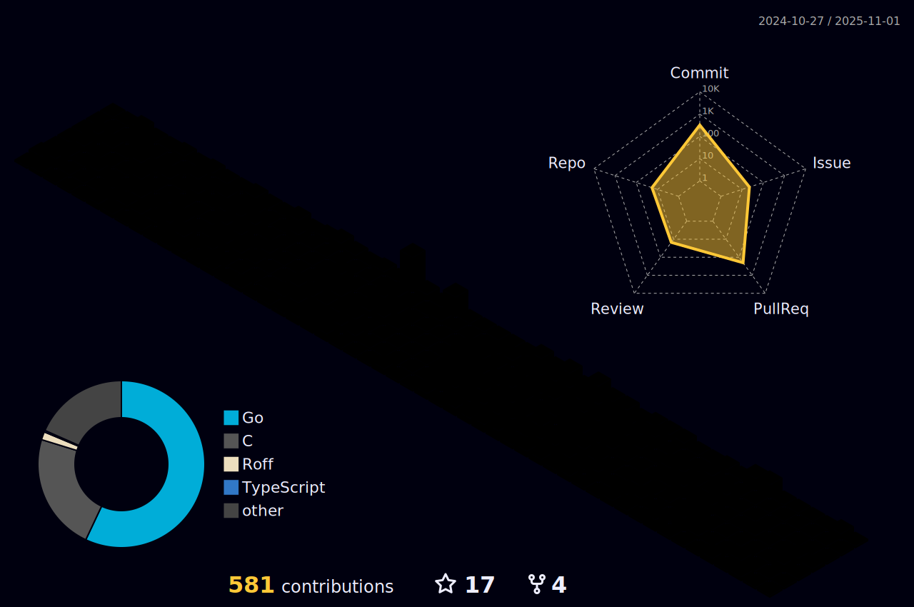

  
  

  
  

  
  <h1 align="center">
  
</h1>
  

  

---

### :man_technologist: About Me :
I am a Software Developer  from India.

- :telescope: I contribute to web backend, compilers, end-user applications, and cloud-native technologies in open source.

- :zap: In my free time, I do Competitve programming.

- :mailbox:How to reach me: 

 ---

### :hammer_and_wrench: Languages and Tools :

  &nbsp;
  &nbsp;
  &nbsp;
  &nbsp;
  &nbsp;
  &nbsp;
  &nbsp;
  &nbsp;
 &nbsp;
  &nbsp;
   &nbsp;
  &nbsp;
   &nbsp;
   &nbsp;
    &nbsp;
  &nbsp;

---

### :fire: My Stats :

  
  

  

---

### :computer: Github 3D Contribution

---

### :zap: Recent Activity :

This is a list of my most recent activity on GitHub.

<!--START_SECTION:activity-->
1. 🗣 Commented on [#4665](https://github.com/OSGeo/grass/pull/4665#issuecomment-2461346605) in [OSGeo/grass](https://github.com/OSGeo/grass)
2. 💪 Opened PR [#4665](https://github.com/OSGeo/grass/pull/4665) in [OSGeo/grass](https://github.com/OSGeo/grass)
3. 🗣 Commented on [#4660](https://github.com/OSGeo/grass/issues/4660#issuecomment-2461271225) in [OSGeo/grass](https://github.com/OSGeo/grass)
4. 🗣 Commented on [#4660](https://github.com/OSGeo/grass/issues/4660#issuecomment-2461250045) in [OSGeo/grass](https://github.com/OSGeo/grass)
5. ❗ Opened issue [#4660](https://github.com/OSGeo/grass/issues/4660) in [OSGeo/grass](https://github.com/OSGeo/grass)
6. 🗣 Commented on [#3020](https://github.com/OSGeo/grass/issues/3020#issuecomment-2459802499) in [OSGeo/grass](https://github.com/OSGeo/grass)
7. 🗣 Commented on [#4555](https://github.com/OSGeo/grass/pull/4555#issuecomment-2457397256) in [OSGeo/grass](https://github.com/OSGeo/grass)
8. 🗣 Commented on [#520](https://github.com/kcl-lang/kpm/pull/520#issuecomment-2456393003) in [kcl-lang/kpm](https://github.com/kcl-lang/kpm)
9. 💪 Opened PR [#520](https://github.com/kcl-lang/kpm/pull/520) in [kcl-lang/kpm](https://github.com/kcl-lang/kpm)
10. 🗣 Commented on [#3020](https://github.com/OSGeo/grass/issues/3020#issuecomment-2455199569) in [OSGeo/grass](https://github.com/OSGeo/grass)
<!--END_SECTION:activity-->
