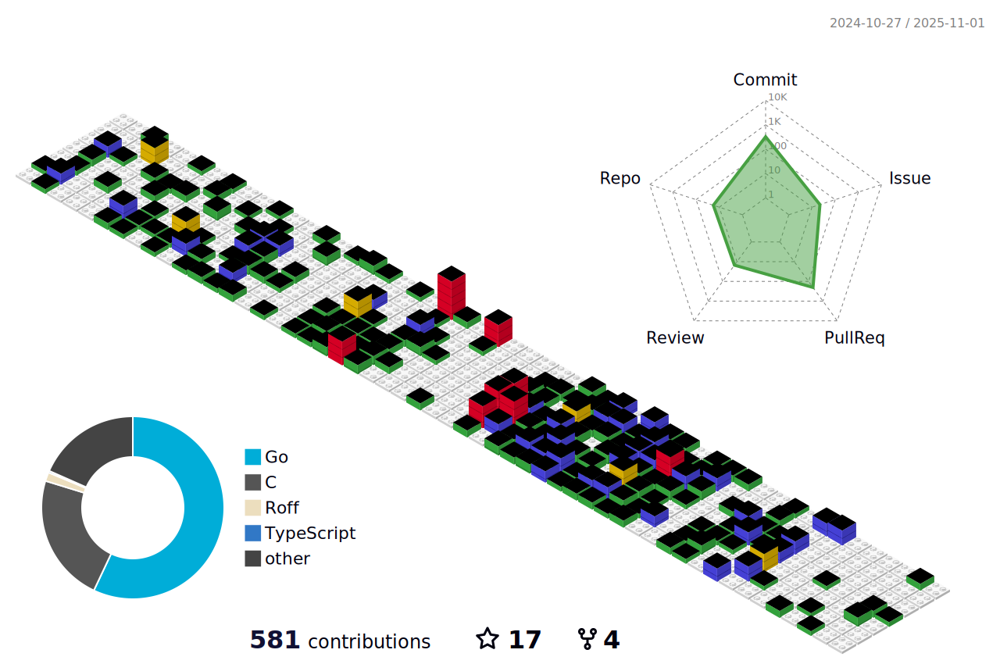

  
  

  
  
     
  
  

  
  <h1 align="center">
  
</h1>
  

  

## :man_technologist: About Me :
I am a Software Developer  from India, passionate about building innovative solutions and contributing to the open source community.
- Experience:
  - 🎓 LFX Mentee with CNCF-KCL (Sept 2024 – Nov 2024)
  - 👨‍💻 SWE Intern at Cisco (May 2024 – July 2024)
-  🚀 Actively involved in open source projects focused on web backend development, end-user applications, cloud-native solutions, and blockchain technologies.
- 🏆 I enjoy competitive programming in my free time, constantly challenging myself to grow and innovate.

- :mailbox: How to reach me:  

## :hammer_and_wrench: Languages and Tools :

  &nbsp;
   &nbsp;
     &nbsp;
   
   &nbsp;
   &nbsp;
    &nbsp;
  &nbsp;
    &nbsp;
   &nbsp;
  &nbsp;
  &nbsp;
  &nbsp;
  &nbsp;
  &nbsp;
  &nbsp;
   &nbsp;
  &nbsp;

<!-- ---

## :fire: My Stats :

  
  

 -->

## :telescope: My Open Source Contributions
| 🎁 Repo | ⭐ Stars | 📚 Forks | ✨ Contributions |
| --- | --- | --- | --- |
|  |  |  | [Issues](https://github.com/OSGeo/grass/issues?q=is%3Aissue%20author%3ANishantBansal2003%20) \| [Pull Requests](https://github.com/OSGeo/grass/pulls?q=is%3Apr+author%3ANishantBansal2003+)
|  |  |  | [Issues](https://github.com/lightningnetwork/lnd/issues?q=is%3Aissue%20author%3ANishantBansal2003%20) \| [Pull Requests](https://github.com/lightningnetwork/lnd/pulls?q=is%3Apr+author%3ANishantBansal2003+)
|  |  |  | [Issues](https://github.com/ElementsProject/lightning/issues?q=is%3Aissue%20author%3ANishantBansal2003%20) \| [Pull Requests](https://github.com/ElementsProject/lightning/pulls?q=is%3Apr+author%3ANishantBansal2003+)
|  |  |  | [Issues](https://github.com/kcl-lang/kpm/issues?q=is%3Aissue%20author%3ANishantBansal2003%20) \| [Pull Requests](https://github.com/kcl-lang/kpm/pulls?q=is%3Apr+author%3ANishantBansal2003+)
|  |  |  | [Issues](https://github.com/kcl-lang/modules/issues?q=is%3Aissue%20author%3ANishantBansal2003%20) \| [Pull Requests](https://github.com/kcl-lang/modules/pulls?q=is%3Apr+author%3ANishantBansal2003+)
|  |  |  | [Issues](https://github.com/keploy/keploy/issues?q=is%3Aissue%20author%3ANishantBansal2003%20) \| [Pull Requests](https://github.com/keploy/keploy/pulls?q=is%3Apr+author%3ANishantBansal2003+)
|  |  |  | [Issues](https://github.com/keploy/samples-go/issues?q=is%3Aissue%20author%3ANishantBansal2003%20) \| [Pull Requests](https://github.com/keploy/samples-go/pulls?q=is%3Apr+author%3ANishantBansal2003+)
|  |  |  | [Issues](https://github.com/karmada-io/karmada/issues?q=is%3Aissue%20author%3ANishantBansal2003%20) \| [Pull Requests](https://github.com/karmada-io/karmada/pulls?q=is%3Apr+author%3ANishantBansal2003+)
|  |  |  | [Issues](https://github.com/kubeedge/kubeedge/issues?q=is%3Aissue%20author%3ANishantBansal2003%20) \| [Pull Requests](https://github.com/kubeedge/kubeedge/pulls?q=is%3Apr+author%3ANishantBansal2003+)
|  |  |  | [Issues](https://github.com/thanos-io/thanos/issues?q=is%3Aissue%20author%3ANishantBansal2003%20) \| [Pull Requests](https://github.com/thanos-io/thanos/pulls?q=is%3Apr+author%3ANishantBansal2003+)
|  |  |  | [Issues](https://github.com/lcompilers/lpython/issues?q=is%3Aissue%20author%3ANishantBansal2003%20) \| [Pull Requests](https://github.com/lcompilers/lpython/pulls?q=is%3Apr+author%3ANishantBansal2003+)
|  |  |  | [Issues](https://github.com/lfortran/lfortran/issues?q=is%3Aissue%20author%3ANishantBansal2003%20) \| [Pull Requests](https://github.com/lfortran/lfortran/pulls?q=is%3Apr+author%3ANishantBansal2003+)

## :computer: Github 3D Contribution

## :zap: Recent Activity :

This is a list of my most recent activity on GitHub.

<!--START_SECTION:activity-->
1. ❌ Closed PR [#5](https://github.com/NishantBansal2003/grass/pull/5) in [NishantBansal2003/grass](https://github.com/NishantBansal2003/grass)
2. 🗣 Commented on [#5198](https://github.com/OSGeo/grass/pull/5198#issuecomment-2696979037) in [OSGeo/grass](https://github.com/OSGeo/grass)
3. 💪 Opened PR [#5281](https://github.com/OSGeo/grass/pull/5281) in [OSGeo/grass](https://github.com/OSGeo/grass)
4. 💪 Opened PR [#5](https://github.com/NishantBansal2003/grass/pull/5) in [NishantBansal2003/grass](https://github.com/NishantBansal2003/grass)
5. 🗣 Commented on [#5233](https://github.com/OSGeo/grass/pull/5233#issuecomment-2691372909) in [OSGeo/grass](https://github.com/OSGeo/grass)
6. 💪 Opened PR [#5233](https://github.com/OSGeo/grass/pull/5233) in [OSGeo/grass](https://github.com/OSGeo/grass)
7. 🗣 Commented on [#5210](https://github.com/OSGeo/grass/issues/5210#issuecomment-2690778913) in [OSGeo/grass](https://github.com/OSGeo/grass)
8. 🗣 Commented on [#1551](https://github.com/actions/cache/issues/1551#issuecomment-2690730001) in [actions/cache](https://github.com/actions/cache)
9. 🗣 Commented on [#5210](https://github.com/OSGeo/grass/issues/5210#issuecomment-2690698794) in [OSGeo/grass](https://github.com/OSGeo/grass)
10. 🗣 Commented on [#1551](https://github.com/actions/cache/issues/1551#issuecomment-2690537006) in [actions/cache](https://github.com/actions/cache)
<!--END_SECTION:activity-->

